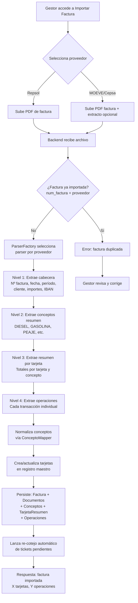
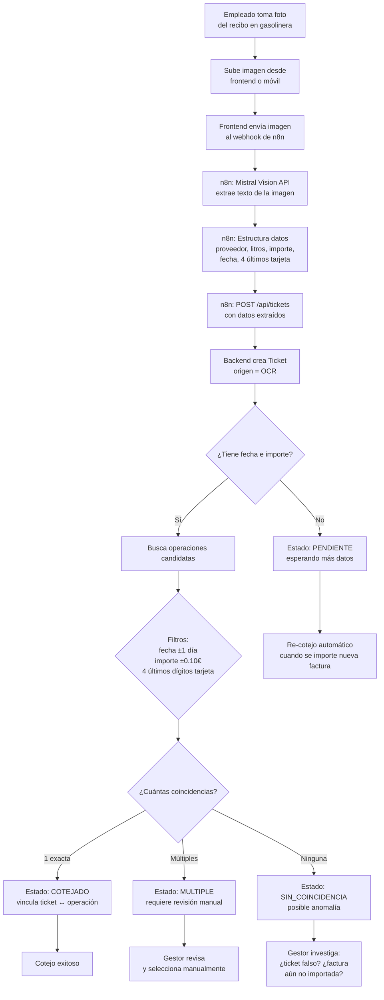
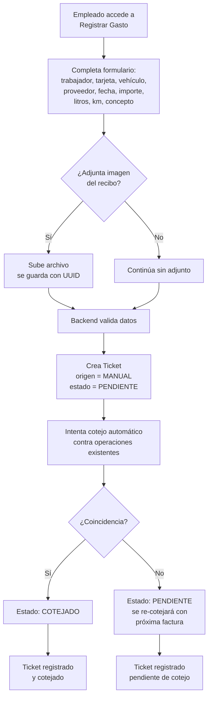
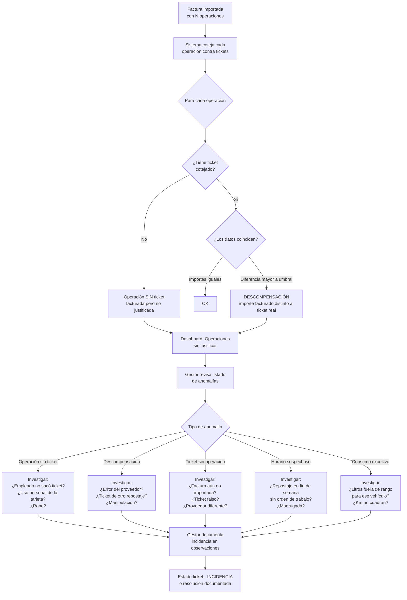
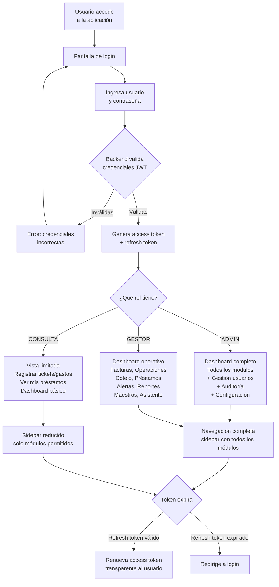
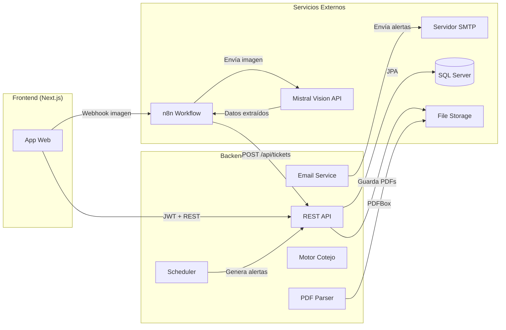
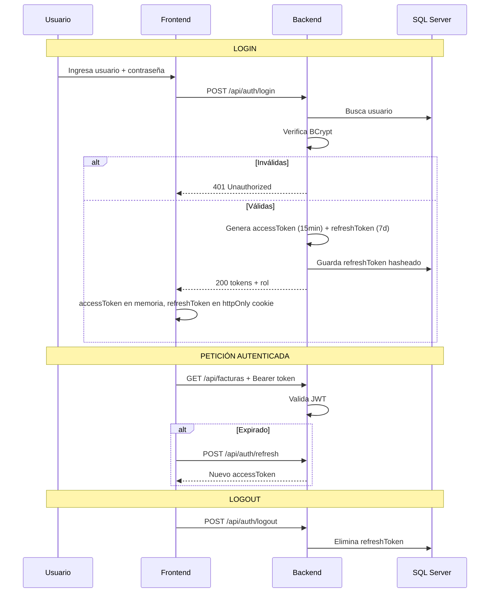
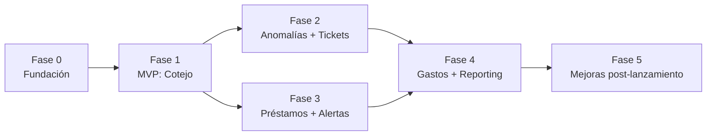

# PRD — Tecozam Bills Manager

> **Versión**: 1.0  
> **Fecha**: 2026-04-06  
> **Estado**: Borrador definitivo  

---

## Tabla de Contenidos

1. [Visión y Alcance del Producto](#1-visión-y-alcance-del-producto)
2. [Stack Tecnológico](#2-stack-tecnológico)
3. [Modelo de Datos (ERD)](#3-modelo-de-datos-erd)
4. [Flujos de Usuario](#4-flujos-de-usuario)
5. [User Stories](#5-user-stories)
6. [UI/UX y Paleta de Colores](#6-uiux-y-paleta-de-colores)
7. [Estructura de Carpetas](#7-estructura-de-carpetas)
8. [Integraciones](#8-integraciones)
9. [Seguridad y Roles](#9-seguridad-y-roles)
10. [Roadmap y Fases](#10-roadmap-y-fases)

---

## 1. Visión y Alcance del Producto

**Nombre**: Tecozam Bills Manager

**Visión**: Sistema integral de control y cotejo de gastos de flota para Tecozam. Automatiza la reconciliación entre lo que facturan los proveedores de combustible/peajes y lo que realmente consumen los empleados, eliminando el proceso manual actual y permitiendo detectar robos, fraudes, descompensaciones y anomalías en tiempo real.

### Problema principal

Tecozam gestiona una flota de vehículos con tarjetas de combustible (Repsol, MOEVE/Cepsa) y dispositivos VIAT para peajes. Actualmente, **el cotejo entre lo que factura el proveedor y lo que realmente se consumió se hace A MANO**. Esto implica:

- Horas de trabajo manual cruzando facturas con tickets de gasolinera
- Imposibilidad de detectar robos o usos indebidos a tiempo (un empleado que carga combustible para uso personal, litros que no cuadran, repostajes en horarios/ubicaciones sospechosas)
- Descompensaciones entre lo facturado y lo real que pasan desapercibidas
- Sin visibilidad de gastos por vehículo, conductor o centro de coste
- Sin alertas automáticas cuando algo no cuadra

### Solución

Un sistema que:

1. **Importa automáticamente** las facturas de los proveedores (PDF parsing)
2. **Captura los tickets reales** vía OCR (foto del recibo → datos estructurados)
3. **Coteja automáticamente** factura vs ticket: fecha, importe, tarjeta, litros, ubicación
4. **Detecta anomalías**: descompensaciones de importe, repostajes fuera de horario, consumos excesivos, tickets sin factura o facturas sin ticket
5. **Controla los recursos**: quién tiene qué tarjeta/vehículo/VIAT, desde cuándo, y cuándo debe devolverlo
6. **Genera reportes y alertas** para que la dirección tenga visibilidad total del gasto de flota

### Usuarios objetivo

| Rol | Perfil | Necesidad principal |
|---|---|---|
| **ADMIN** | Administrador del sistema | Configuración, usuarios, auditoría completa |
| **GESTOR** | Responsable de flota / Supervisor | Cotejar gastos, detectar anomalías, gestionar préstamos, ver reportes |
| **CONSULTA** | Conductor / Personal de campo | Registrar tickets de gasto, ver sus préstamos asignados |

### Alcance funcional (10 módulos)

1. **Facturas** — importación y parseo automático de PDFs (Repsol, MOEVE)
2. **Operaciones** — consulta granular de cada transacción facturada
3. **Tickets/OCR** — captura de recibos reales y cotejo automático contra facturas
4. **Préstamos** — ciclo completo de asignación/devolución de tarjetas, vehículos y VIATs
5. **Alertas** — notificaciones proactivas de vencimientos, anomalías y descompensaciones
6. **Gastos** — registro, validación y seguimiento del gasto operativo real
7. **Maestros** — catálogos de vehículos, tarjetas, VIATs, centros de coste, conductores, proveedores
8. **Dashboard/Reporting** — KPIs de gasto, gráficos comparativos, métricas por vehículo/conductor/centro de coste
9. **Asistente** — consultas sobre estado del sistema (préstamos, alertas, resúmenes)
10. **Seguridad** — JWT, roles, auditoría, encriptación de datos sensibles

### Métrica de éxito

Reducir el tiempo de cotejo manual de facturas de horas/días a MINUTOS, y detectar el 100% de las descompensaciones de forma automática.

---

## 2. Stack Tecnológico

### Backend

| Tecnología | Versión | Justificación |
|---|---|---|
| **Java** | 21 (LTS) | Virtual threads, pattern matching, records |
| **Spring Boot** | 3.4.x | REST, seguridad, scheduling, ecosistema maduro |
| **Spring Security + JWT** | — | Auth stateless con access + refresh tokens |
| **Spring Data JPA + Hibernate** | — | Specifications para queries dinámicas |
| **Microsoft SQL Server** | 2019+ | BD corporativa de Tecozam. Uniformidad con el resto de sistemas de la empresa |
| **Flyway** | — | Migraciones versionadas (soporte nativo para MSSQL) |
| **Apache PDFBox** | 3.x | Parseo de facturas PDF |
| **SpringDoc OpenAPI** | 2.x | Swagger automático |
| **Lombok** | — | Reducción de boilerplate |
| **MapStruct** | — | Mapeo Entity↔DTO tipado y compilado |

### Frontend

| Tecnología | Versión | Justificación |
|---|---|---|
| **Next.js** | 15 (App Router) | SSR, Server Components, API routes |
| **React** | 19 | Server Components nativos |
| **TypeScript** | 5 (strict) | Tipado real, cero `any` |
| **Tailwind CSS** | 4 | Design tokens, CSS variables |
| **shadcn/ui** | — | Componentes accesibles y customizables |
| **TanStack Query** | 5 | Cache, revalidación, loading/error states |
| **Recharts** | 2.x | Gráficos para dashboards |
| **Zod** | — | Validación de schemas y forms |
| **Lucide React** | — | Iconografía |

### Integraciones

| Tecnología | Propósito |
|---|---|
| **n8n** | Workflow OCR: foto → Mistral Vision → datos → POST API |
| **Mistral Vision API** | Extracción de texto de tickets |
| **SMTP (corporativo)** | Emails de alerta |
| **Vercel** | Deploy frontend |
| **Backend deploy** | Por definir |

### Testing y calidad

| Herramienta | Propósito |
|---|---|
| **JUnit 5 + Mockito + Testcontainers** | Tests con SQL Server real en container |
| **Vitest + Testing Library** | Tests frontend |
| **ESLint + Prettier** | Linting frontend |
| **Checkstyle** | Calidad backend |

---

## 3. Modelo de Datos (ERD)

### Decisiones de unificación

El modelo unifica las entidades de los 3 prototipos existentes:

| Duplicidad | Resolución |
|---|---|
| `Conductor` (facturas-api) + `Trabajador` (ControlGastos) | → **Trabajador** (concepto más amplio) |
| `Tarjeta` (ambos) | → Una sola **Tarjeta** con campos de ambos |
| `Vehiculo` (ambos) | → Un solo **Vehiculo** con tipo + estado de recurso |
| `CentroCoste` (ambos) | → Un solo **CentroCoste** |
| `Proveedor` enum + entity | → **Proveedor** como entidad (extensible) |
| `Ticket` OCR + `Ticket` manual | → Un solo **Ticket** con campo `origen` (MANUAL / OCR) |

### Diagrama ERD (19 entidades)

```mermaid
erDiagram
    %% ===== SEGURIDAD =====
    Usuario {
        bigint id PK
        varchar username UK "max 80"
        varchar password "BCrypt hash"
        varchar rol "ADMIN | GESTOR | CONSULTA"
        boolean activo
        bigint trabajador_id FK
        datetime creado_en
        datetime modificado_en
    }

    %% ===== PERSONAS =====
    Trabajador {
        bigint id PK
        varchar nombre "max 100"
        varchar apellidos "max 100"
        varchar email UK "nullable"
        varchar dni_nie "AES-256 encrypted"
        boolean activo
        datetime creado_en
        datetime modificado_en
        datetime eliminado_en "soft delete"
    }

    %% ===== RECURSOS =====
    Proveedor {
        bigint id PK
        varchar codigo UK "REPSOL | MOEVE_CEPSA | ..."
        varchar nombre "max 150"
        varchar nif "max 20, nullable"
        boolean activo
    }

    Vehiculo {
        bigint id PK
        varchar matricula UK
        varchar tipo "TURISMO | FURGONETA | CAMION | MAQUINARIA"
        varchar descripcion "nullable"
        varchar estado "DISPONIBLE | PRESTADO | BLOQUEADO | BAJA"
        boolean activo
        datetime creado_en
        datetime modificado_en
    }

    Tarjeta {
        bigint id PK
        varchar numero_tarjeta UK
        varchar alias "nullable"
        bigint proveedor_id FK
        varchar estado "DISPONIBLE | PRESTADO | BLOQUEADO | BAJA"
        boolean activa
        datetime creado_en
        datetime modificado_en
    }

    TarjetaAsignacion {
        bigint id PK
        bigint tarjeta_id FK
        bigint trabajador_id FK
        bigint vehiculo_id FK "nullable"
        date fecha_desde
        date fecha_hasta "null = vigente"
    }

    Viat {
        bigint id PK
        varchar codigo UK "max 50"
        varchar numero_serie "max 100, nullable"
        varchar descripcion "max 300, nullable"
        varchar estado "DISPONIBLE | PRESTADO | BLOQUEADO | BAJA"
        boolean activo
        datetime creado_en
        datetime modificado_en
    }

    CentroCoste {
        bigint id PK
        varchar codigo UK "ej: T-907"
        varchar nombre "max 120"
        varchar descripcion "max 300, nullable"
        boolean activo
        datetime creado_en
        datetime modificado_en
    }

    %% ===== FACTURAS =====
    Factura {
        bigint id PK
        bigint proveedor_id FK
        varchar num_factura "UK con proveedor_id"
        date fecha
        date periodo_desde
        date periodo_hasta
        varchar num_cuenta
        varchar nif_cliente
        varchar nombre_cliente
        decimal base_imponible "12,2"
        decimal total_iva "12,2"
        decimal total_factura "12,2"
        date vencimiento
        varchar iban "AES-256 encrypted"
        varchar ruta_pdf
        datetime creado_en
        varchar creado_por
        datetime modificado_en
        varchar modificado_por
    }

    FacturaDocumento {
        bigint id PK
        bigint factura_id FK
        varchar pais
        varchar num_documento
        date fecha_documento
        decimal importe "12,2"
    }

    FacturaConceptoResumen {
        bigint id PK
        bigint factura_id FK
        varchar concepto_original
        varchar concepto_unificado "DIESEL | GASOLINA | ADBLUE | PEAJE | LAVADO | LUBRICANTE | OTROS | DESCUENTO"
        decimal cantidad "12,2"
        decimal base_imponible "12,2"
        decimal tipo_iva "5,2"
        decimal cuota_iva "12,2"
        decimal importe "12,2"
    }

    TarjetaResumen {
        bigint id PK
        bigint factura_id FK
        bigint tarjeta_id FK
        varchar num_tarjeta
        varchar alias
        varchar conductor
    }

    TarjetaResumenConcepto {
        bigint id PK
        bigint tarjeta_resumen_id FK
        varchar concepto_original
        varchar concepto_unificado
        decimal importe "10,2"
        decimal cantidad "10,2"
        decimal total_bonificacion "10,2"
    }

    Operacion {
        bigint id PK
        bigint tarjeta_resumen_id FK
        bigint factura_id FK
        varchar referencia
        datetime fecha_hora "indexed"
        varchar concepto_original
        varchar concepto_unificado "indexed"
        varchar establecimiento
        int kms "nullable"
        decimal cantidad "10,2"
        decimal precio_neto "8,3"
        decimal precio_iva_inc "8,3"
        decimal precio_unitario "8,3"
        decimal precio_aplicado "8,3"
        decimal importe "10,2"
        decimal importe_total "10,2"
        decimal dto_porcentaje "5,2"
        decimal dto_total "10,2"
        decimal bonificacion "10,2"
        varchar observaciones "A,T,C,F flags"
    }

    %% ===== TICKETS =====
    Ticket {
        bigint id PK
        varchar origen "MANUAL | OCR"
        bigint proveedor_id FK
        bigint trabajador_id FK "nullable si OCR"
        bigint tarjeta_id FK "nullable"
        bigint vehiculo_id FK "nullable"
        varchar estacion "max 150"
        varchar direccion "max 250, nullable"
        datetime fecha_hora
        varchar num_tarjeta_4ultimos "nullable"
        varchar matricula "nullable"
        int kms "nullable"
        varchar producto "nullable"
        decimal litros "10,2 nullable"
        decimal precio_litro "8,3 nullable"
        decimal importe_total "10,2"
        varchar num_recibo "nullable"
        varchar nif_estacion "nullable"
        varchar imagen_url "nullable"
        varchar concepto "max 150, nullable"
        varchar observaciones "max 500, nullable"
        varchar estado_cotejo "PENDIENTE | COTEJADO | MULTIPLE | SIN_COINCIDENCIA | INCIDENCIA"
        bigint operacion_cotejada_id FK "nullable"
        datetime creado_en
        datetime modificado_en
    }

    %% ===== PRESTAMOS =====
    Prestamo {
        bigint id PK
        varchar tipo_recurso "TARJETA | VIAT | VEHICULO"
        bigint tarjeta_id FK "nullable"
        bigint viat_id FK "nullable"
        bigint vehiculo_id FK "nullable"
        bigint trabajador_id FK
        bigint centro_coste_id FK
        varchar tipo_prestamo "CON_FECHA_FIN | HASTA_REPOSICION"
        varchar estado "ACTIVO | PENDIENTE_DEVOLUCION | VENCIDO | DEVUELTO | CANCELADO"
        date fecha_inicio
        date fecha_fin_prevista "nullable"
        date fecha_devolucion_real "nullable"
        varchar observaciones "max 500"
        boolean alerta_3d_enviada
        boolean alerta_1d_enviada
        boolean alerta_hoy_enviada
        boolean email_ultimo_dia
        datetime creado_en
        datetime modificado_en
    }

    AlertaPrestamo {
        bigint id PK
        bigint prestamo_id FK
        varchar tipo_alerta "TRES_DIAS_ANTES | UN_DIA_ANTES | MISMO_DIA | VENCIDO"
        date fecha_alerta
        varchar mensaje "max 500"
        boolean email_enviado
        boolean leida
        datetime creado_en
    }

    %% ===== AUDITORIA =====
    AuditLog {
        bigint id PK
        varchar tabla "max 100"
        bigint registro_id
        varchar accion "INSERT | UPDATE | DELETE"
        bigint usuario_id FK "nullable"
        nvarchar datos_anteriores "JSON, nullable"
        nvarchar datos_nuevos "JSON, nullable"
        datetime fecha
    }

    %% ===== RELACIONES =====
    Usuario ||--o| Trabajador : "tiene perfil"
    Tarjeta }o--|| Proveedor : "pertenece a"
    TarjetaAsignacion }o--|| Tarjeta : "asigna"
    TarjetaAsignacion }o--|| Trabajador : "asignada a"
    TarjetaAsignacion }o--o| Vehiculo : "asociada a"

    Factura }o--|| Proveedor : "emitida por"
    FacturaDocumento }o--|| Factura : "subdocumento de"
    FacturaConceptoResumen }o--|| Factura : "resumen de"
    TarjetaResumen }o--|| Factura : "dentro de"
    TarjetaResumen }o--|| Tarjeta : "referencia"
    TarjetaResumenConcepto }o--|| TarjetaResumen : "desglose de"
    Operacion }o--|| TarjetaResumen : "pertenece a"
    Operacion }o--|| Factura : "facturada en"

    Ticket }o--o| Proveedor : "proveedor"
    Ticket }o--o| Trabajador : "registrado por"
    Ticket }o--o| Tarjeta : "pagado con"
    Ticket }o--o| Vehiculo : "vehiculo"
    Ticket }o--o| Operacion : "cotejado con"

    Prestamo }o--o| Tarjeta : "presta"
    Prestamo }o--o| Viat : "presta"
    Prestamo }o--o| Vehiculo : "presta"
    Prestamo }o--|| Trabajador : "asignado a"
    Prestamo }o--|| CentroCoste : "imputa a"
    AlertaPrestamo }o--|| Prestamo : "alerta de"

    AuditLog }o--o| Usuario : "realizado por"
```



### Índices clave (MSSQL)

```sql
-- Operaciones: búsquedas frecuentes
CREATE INDEX IX_operacion_fecha ON operaciones(fecha_hora);
CREATE INDEX IX_operacion_concepto ON operaciones(concepto_unificado);
CREATE INDEX IX_operacion_factura ON operaciones(factura_id);

-- Tickets: cotejo
CREATE INDEX IX_ticket_fecha ON tickets(fecha_hora);
CREATE INDEX IX_ticket_tarjeta4 ON tickets(num_tarjeta_4ultimos);
CREATE INDEX IX_ticket_estado ON tickets(estado_cotejo);

-- Préstamos: consultas por estado
CREATE INDEX IX_prestamo_estado ON prestamos(estado);
CREATE INDEX IX_prestamo_fecha_fin ON prestamos(fecha_fin_prevista);

-- Alertas: pendientes
CREATE INDEX IX_alerta_leida ON alertas_prestamo(leida, fecha_alerta);

-- Factura: unicidad compuesta
CREATE UNIQUE INDEX UQ_factura_num_prov ON facturas(num_factura, proveedor_id);
```

---

## 4. Flujos de Usuario

### Flujo 1 — Importación y parseo de factura PDF



### Flujo 2 — Captura OCR y cotejo automático de ticket



### Flujo 3 — Registro manual de gasto



### Flujo 4 — Ciclo de vida de préstamo de recurso

```mermaid
flowchart TD
    A[Gestor accede a\nNuevo Préstamo] --> B[Selecciona tipo recurso:\nTARJETA | VIAT | VEHÍCULO]

    B --> C[Selecciona recurso específico\nde los DISPONIBLES]
    C --> D[Selecciona trabajador\ny centro de coste]
    D --> E{Tipo de préstamo}

    E -->|CON_FECHA_FIN| F[Define fecha inicio\ny fecha fin prevista]
    E -->|HASTA_REPOSICIÓN| G[Define solo fecha inicio\nsin fecha límite]

    F --> H[Backend valida]
    G --> H

    H --> I{¿Validaciones OK?\nRecurso disponible,\ntrabajador existe,\nfechas coherentes}

    I -->|No| J[Error con detalle\nde la validación]
    I -->|Sí| K[Crea préstamo\nestado = ACTIVO]

    K --> L[Recurso pasa a\nestado PRESTADO]
    L --> M[Evalúa alertas inmediatas\n¿ya vencido? ¿vence hoy?]

    M --> N[Préstamo activo]

    N --> O{Ciclo de alertas\ncron diario 8:00 AM}

    O -->|3 días antes| P[Alerta: TRES_DIAS_ANTES]
    O -->|1 día antes| Q[Alerta: UN_DIA_ANTES]
    O -->|Mismo día| R[Alerta: MISMO_DIA\n+ EMAIL al supervisor]
    O -->|Pasó la fecha| S[Estado - VENCIDO\nAlerta: VENCIDO]

    P --> O
    Q --> O
    R --> O

    S --> T{Gestor decide}
    T -->|Devolver| U[Registra devolución\nfecha real + notas]
    T -->|Cancelar| V[Cancela préstamo]

    U --> W[Estado - DEVUELTO\nRecurso - DISPONIBLE]
    V --> X[Estado - CANCELADO\nRecurso - DISPONIBLE]
```

### Flujo 5 — Detección de anomalías y descompensaciones



### Flujo 6 — Autenticación y navegación por rol



---

## 5. User Stories

### ÉPICA 1 — Facturas (FAC)

**FAC-01** — Importar factura PDF de Repsol
> Como **GESTOR**, quiero subir un PDF de factura Repsol y que el sistema extraiga automáticamente todos los datos (cabecera, conceptos, tarjetas, operaciones), para no tener que transcribir manualmente.

Criterios de aceptación:
- Acepta PDF de hasta 50MB
- Extrae los 4 niveles: cabecera → conceptos → tarjetas → operaciones
- Detecta documentos auxiliares (rectificativas, facturas Portugal)
- Rechaza factura duplicada (mismo num_factura + proveedor)
- Crea/actualiza tarjetas en el registro maestro
- Lanza re-cotejo automático de tickets pendientes al finalizar
- Muestra resumen: nº factura, X tarjetas, Y operaciones importadas

**FAC-02** — Importar factura PDF de MOEVE/Cepsa
> Como **GESTOR**, quiero subir un PDF de factura MOEVE (y opcionalmente el extracto), para importar las operaciones de este proveedor.

Criterios de aceptación:
- Acepta factura sola o factura + extracto (2 PDFs)
- Detecta tipo de documento (FACTURA vs EXTRACTO)
- Mismos 4 niveles de extracción que Repsol
- Mapea conceptos MOEVE al catálogo unificado

**FAC-03** — Listar facturas con filtros
> Como **GESTOR**, quiero ver un listado de todas las facturas importadas, pudiendo filtrar por proveedor, para tener visibilidad del histórico.

Criterios de aceptación:
- Tabla con: nº factura, proveedor, fecha, período, base imponible, IVA, total
- Filtro por proveedor (Todos / Repsol / MOEVE)
- Ordenación por fecha descendente
- Paginación
- Link a detalle de cada factura

**FAC-04** — Ver detalle de factura
> Como **GESTOR**, quiero ver el detalle completo de una factura con sus conceptos, tarjetas y operaciones, para auditar lo que se ha facturado.

Criterios de aceptación:
- Cabecera: datos generales de la factura
- Tab Conceptos: resumen por tipo (DIESEL, PEAJE, etc.) con importes
- Tab Tarjetas: resumen por tarjeta con desglose de conceptos
- Tab Operaciones: listado de cada transacción individual
- Indicador visual de operaciones sin ticket cotejado

**FAC-05** — Ver estadísticas generales
> Como **GESTOR**, quiero ver KPIs globales (total facturas, operaciones, importes por proveedor), para tener una foto rápida del gasto.

Criterios de aceptación:
- Cards: total facturas, total operaciones, importe total
- Desglose por proveedor (Repsol vs MOEVE)
- Formato moneda EUR

### ÉPICA 2 — Operaciones (OPE)

**OPE-01** — Consultar operaciones con filtros avanzados
> Como **GESTOR**, quiero buscar operaciones individuales filtrando por proveedor, concepto, tarjeta/conductor, y rango de fechas, para investigar transacciones concretas.

Criterios de aceptación:
- Filtros combinables: proveedor, concepto unificado, tarjeta (búsqueda fuzzy por alias/número/conductor), fecha desde/hasta
- Paginación configurable (por defecto 50)
- Columnas: fecha/hora, tarjeta, concepto, establecimiento, litros, precio, importe, bonificación
- Exportable (fase futura)

**OPE-02** — Ver detalle de operación
> Como **GESTOR**, quiero ver todos los datos de una operación individual, incluyendo si tiene ticket cotejado, para poder auditar la transacción.

Criterios de aceptación:
- Todos los campos: referencia, establecimiento, precios, descuentos, bonificaciones, observaciones (flags A/T/C/F)
- Estado de cotejo: ¿tiene ticket vinculado? ¿cuál?
- Link al ticket cotejado si existe
- Link a la factura de origen

### ÉPICA 3 — Tickets y OCR (TKT)

**TKT-01** — Recibir ticket OCR desde n8n
> Como **SISTEMA**, quiero recibir datos estructurados de un ticket escaneado vía webhook, para crear el registro y lanzar cotejo automático.

Criterios de aceptación:
- Endpoint POST /api/tickets acepta JSON con datos OCR
- Crea ticket con origen = OCR
- Valida campos obligatorios (producto, importe)
- Lanza cotejo automático inmediato
- Devuelve estado de cotejo en la respuesta

**TKT-02** — Subir foto de ticket para OCR
> Como **CONSULTA**, quiero subir una foto del recibo de gasolinera desde la app, para que el sistema la procese y la coteje contra las facturas.

Criterios de aceptación:
- Acepta imagen (JPG, PNG) desde cámara o galería
- Envía al webhook de n8n para procesamiento OCR
- Muestra estado del procesamiento (cargando → resultado)
- Muestra resultado del cotejo (COTEJADO / PENDIENTE / etc.)

**TKT-03** — Registrar ticket de gasto manual
> Como **CONSULTA**, quiero registrar un gasto manualmente (sin OCR) indicando trabajador, tarjeta, vehículo, importe, litros y concepto, para documentar gastos cuando no tengo foto.

Criterios de aceptación:
- Formulario con: trabajador, proveedor, tarjeta, vehículo, fecha, hora, importe, litros, km, concepto, estación, observaciones
- Adjuntar archivo opcional (imagen del recibo)
- Validación de campos obligatorios
- Se crea con origen = MANUAL, estado = PENDIENTE
- Intenta cotejo automático tras guardar

**TKT-04** — Listar tickets con filtro por estado
> Como **GESTOR**, quiero ver todos los tickets filtrados por estado de cotejo, para gestionar los pendientes y las incidencias.

Criterios de aceptación:
- Filtro por estado: TODOS / PENDIENTE / COTEJADO / MÚLTIPLE / SIN_COINCIDENCIA / INCIDENCIA
- Tabla con: fecha, proveedor, estación, importe, litros, estado (badge con color)
- Link al ticket y a la operación cotejada si existe
- Indicador visual claro por estado (verde/amarillo/azul/rojo)

**TKT-05** — Re-cotejar tickets pendientes
> Como **GESTOR**, quiero lanzar un re-cotejo masivo de todos los tickets pendientes/sin coincidencia, para resolver cotejos tras importar nuevas facturas.

Criterios de aceptación:
- Botón "Re-cotejar pendientes"
- Procesa todos los tickets en estado PENDIENTE y SIN_COINCIDENCIA
- Muestra resumen: X cotejados, Y siguen pendientes, Z múltiples

**TKT-06** — Resolver cotejo múltiple manualmente
> Como **GESTOR**, quiero ver los candidatos cuando un ticket tiene múltiples coincidencias y seleccionar la operación correcta, para resolver ambigüedades.

Criterios de aceptación:
- Desde un ticket en estado MULTIPLE, ver lista de operaciones candidatas
- Cada candidata muestra: fecha, establecimiento, importe, tarjeta
- Seleccionar una → ticket pasa a COTEJADO
- Descartar todas → ticket pasa a SIN_COINCIDENCIA

### ÉPICA 4 — Anomalías y Control de Gastos (ANO)

**ANO-01** — Dashboard de anomalías
> Como **GESTOR**, quiero ver un panel con todas las descompensaciones detectadas (operaciones sin ticket, tickets sin operación, diferencias de importe), para investigar posibles robos o errores.

Criterios de aceptación:
- Listado de operaciones facturadas SIN ticket cotejado
- Listado de tickets SIN operación coincidente
- Alertas de descompensación (diferencia importe > umbral configurable)
- Filtros por proveedor, rango de fechas, tarjeta/trabajador
- KPI: % de operaciones cotejadas vs total

**ANO-02** — Detectar repostajes en horarios sospechosos
> Como **GESTOR**, quiero que el sistema marque operaciones realizadas en horarios fuera de jornada laboral (fines de semana, madrugada), para investigar posible uso personal.

Criterios de aceptación:
- Flag automático en operaciones con observación F (fin de semana) ya existente
- Configurar horario laboral (ej: L-V 7:00-20:00)
- Listado de operaciones fuera de horario
- Filtro por trabajador/tarjeta

**ANO-03** — Detectar consumo anómalo por vehículo
> Como **GESTOR**, quiero ver alertas cuando un vehículo tenga un consumo de combustible fuera del rango esperado, para detectar posibles fraudes.

Criterios de aceptación:
- Consumo medio por vehículo (litros/km)
- Alerta cuando el consumo de un período se desvía más de X% del promedio histórico
- Vista comparativa: consumo actual vs media histórica por vehículo

**ANO-04** — Marcar ticket como incidencia
> Como **GESTOR**, quiero poder marcar un ticket como INCIDENCIA y documentar el motivo, para llevar registro de los casos investigados.

Criterios de aceptación:
- Cambiar estado a INCIDENCIA desde cualquier estado
- Campo obligatorio de observaciones al marcar
- Historial visible en el ticket
- Las incidencias aparecen en el dashboard de anomalías

### ÉPICA 5 — Préstamos (PRE)

**PRE-01** — Crear préstamo de recurso
> Como **GESTOR**, quiero asignar una tarjeta, VIAT o vehículo a un trabajador con fecha de inicio y fin prevista, para controlar quién tiene qué recurso.

Criterios de aceptación:
- Seleccionar tipo de recurso y recurso específico (solo DISPONIBLES)
- Seleccionar trabajador y centro de coste
- Tipo: CON_FECHA_FIN (requiere fecha fin) o HASTA_REPOSICIÓN
- Validaciones: recurso disponible, fechas coherentes, trabajador existe
- Al crear: recurso → PRESTADO, préstamo → ACTIVO
- Evaluación inmediata de alertas

**PRE-02** — Devolver préstamo
> Como **GESTOR**, quiero registrar la devolución de un recurso prestado, para liberarlo y que esté disponible para otros.

Criterios de aceptación:
- Botón "Devolver" desde el listado o detalle
- Registra fecha de devolución real
- Campo de notas opcionales
- Préstamo → DEVUELTO, recurso → DISPONIBLE
- No permite devolver un préstamo ya devuelto

**PRE-03** — Listar préstamos con estado
> Como **GESTOR**, quiero ver todos los préstamos con su estado actual (activo, vencido, devuelto), para tener visibilidad de los recursos asignados.

Criterios de aceptación:
- Tabla con: recurso, trabajador, centro coste, tipo, fecha inicio, fecha fin, estado
- Filtros por estado, tipo de recurso, trabajador
- Badges de color por estado
- Ordenación por fecha de creación descendente

**PRE-04** — Cancelar préstamo
> Como **ADMIN**, quiero poder cancelar un préstamo activo, para corregir errores o situaciones excepcionales.

Criterios de aceptación:
- Solo estado ACTIVO o VENCIDO se puede cancelar
- Requiere observaciones obligatorias
- Préstamo → CANCELADO, recurso → DISPONIBLE

### ÉPICA 6 — Alertas (ALE)

**ALE-01** — Generación automática de alertas de vencimiento
> Como **SISTEMA**, quiero generar alertas automáticas a los 3 días, 1 día, mismo día y fecha vencida de cada préstamo, para que los gestores actúen a tiempo.

Criterios de aceptación:
- Tarea programada diaria a las 8:00 AM
- Genera TRES_DIAS_ANTES, UN_DIA_ANTES, MISMO_DIA, VENCIDO
- Deduplicación: no genera alerta duplicada (mismo préstamo + tipo + fecha)
- Marca préstamos vencidos como VENCIDO automáticamente
- Evalúa alertas inmediatamente al crear un préstamo nuevo

**ALE-02** — Email automático de vencimiento
> Como **GESTOR**, quiero recibir un email cuando un préstamo vence HOY, para actuar de inmediato.

Criterios de aceptación:
- Se envía al crear alerta MISMO_DIA
- Contenido: recurso, trabajador, centro coste, fechas, estado
- Destinatario configurable (no hardcodeado)
- Flag email_enviado en la alerta

**ALE-03** — Ver y gestionar alertas
> Como **GESTOR**, quiero ver las alertas pendientes y poder marcarlas como leídas, para gestionar mi bandeja de entrada.

Criterios de aceptación:
- Listado de alertas no leídas, ordenadas por fecha y urgencia
- Filtro por rango de fechas
- Botón "Marcar como leída"
- Badge con contador de alertas pendientes en sidebar/header
- Tipos con color: VENCIDO (rojo), MISMO_DIA (naranja), UN_DIA (amarillo), TRES_DIAS (azul)

### ÉPICA 7 — Gastos y Validaciones (GAS)

**GAS-01** — Panel de gastos por período
> Como **GESTOR**, quiero ver un resumen de gastos agrupados por período, proveedor, centro de coste y vehículo, para controlar el presupuesto operativo.

Criterios de aceptación:
- Filtros: rango de fechas, proveedor, centro de coste, vehículo, trabajador
- Agrupaciones: por proveedor, por concepto, por tarjeta, por vehículo, por centro de coste
- Totales y subtotales
- Gráficos comparativos (barras, líneas de evolución temporal)

**GAS-02** — Validación de gastos
> Como **GESTOR**, quiero un flujo de validación donde pueda aprobar o rechazar gastos registrados, para mantener control sobre lo que se imputa.

Criterios de aceptación:
- Cola de gastos pendientes de validación
- Aprobar / Rechazar con comentario
- Gastos rechazados se marcan como INCIDENCIA
- Solo ADMIN y GESTOR pueden validar

**GAS-03** — Informe de gastos por trabajador
> Como **GESTOR**, quiero ver el desglose de gastos por trabajador en un período, para detectar quién gasta más y en qué.

Criterios de aceptación:
- Seleccionar trabajador y rango de fechas
- Desglose: concepto, importe, litros, nº operaciones
- Comparativa con media del equipo
- Flag si supera X% de la media

### ÉPICA 8 — Maestros (MAE)

**MAE-01** — CRUD de Vehículos
> Como **GESTOR**, quiero gestionar el catálogo de vehículos (crear, editar, activar/desactivar), para mantener actualizada la flota.

Criterios de aceptación:
- Crear: matrícula (única), tipo, descripción
- Editar: todos los campos excepto matrícula
- Activar/Desactivar (soft delete)
- No se puede desactivar si tiene préstamo activo
- Listado con filtro por estado y tipo

**MAE-02** — CRUD de Tarjetas
> Como **GESTOR**, quiero gestionar el catálogo de tarjetas de combustible, para controlar qué tarjetas están activas y de qué proveedor.

Criterios de aceptación:
- Crear: número (único), alias, proveedor
- Editar: alias, proveedor
- Activar/Desactivar
- No se puede desactivar si tiene préstamo activo
- Ver historial de asignaciones (trabajador + vehículo + período)

**MAE-03** — CRUD de VIATs
> Como **GESTOR**, quiero gestionar los dispositivos VIAT de peaje, para saber cuáles están disponibles.

Criterios de aceptación:
- Crear: código (único), número serie, descripción
- Editar, Activar/Desactivar
- No se puede desactivar si tiene préstamo activo

**MAE-04** — CRUD de Centros de Coste
> Como **GESTOR**, quiero gestionar los centros de coste, para imputar correctamente préstamos y gastos.

Criterios de aceptación:
- Crear: código (único), nombre, descripción
- Editar, Activar/Desactivar
- No se puede desactivar si tiene préstamos activos asociados

**MAE-05** — CRUD de Trabajadores
> Como **ADMIN**, quiero gestionar el catálogo de empleados, para asignarles recursos y vincularlos a gastos.

Criterios de aceptación:
- Crear: nombre, apellidos, email (único), DNI/NIE (encriptado AES-256)
- Editar todos los campos
- Activar/Desactivar (soft delete)
- No se puede desactivar si tiene préstamo activo
- Ver recursos actualmente asignados

**MAE-06** — CRUD de Proveedores
> Como **ADMIN**, quiero gestionar los proveedores de combustible/peajes, para poder añadir nuevos sin tocar código.

Criterios de aceptación:
- Crear: código (único), nombre, NIF
- Editar, Activar/Desactivar
- Código se usa para estrategia de parseo de facturas

**MAE-07** — Gestión de asignaciones de tarjeta
> Como **GESTOR**, quiero asignar una tarjeta a un trabajador y vehículo con fecha, manteniendo el historial de asignaciones anteriores, para saber quién usó cada tarjeta en cada momento.

Criterios de aceptación:
- Asignar: tarjeta + trabajador + vehículo (opcional) + fecha desde
- Al reasignar: cierra asignación anterior (fecha_hasta = hoy)
- Historial completo visible en el detalle de la tarjeta

### ÉPICA 9 — Dashboard y Reporting (DSH)

**DSH-01** — Dashboard principal
> Como **GESTOR**, quiero un dashboard con KPIs clave al entrar al sistema, para tener visibilidad inmediata del estado de la flota y los gastos.

Criterios de aceptación:
- KPIs: total facturas, operaciones, importe total, % cotejado, préstamos activos, alertas pendientes, anomalías detectadas
- Gráficos: gasto por proveedor (barras), evolución mensual (líneas), distribución por concepto (donut)
- Alertas recientes y préstamos próximos a vencer
- Responsive

**DSH-02** — Dashboard por rol
> Como **CONSULTA**, quiero ver un dashboard adaptado a mi rol con solo la información que me corresponde, para no ver datos que no necesito.

Criterios de aceptación:
- ADMIN/GESTOR: dashboard completo
- CONSULTA: solo mis tickets registrados, mis préstamos, resumen básico de gastos

**DSH-03** — Reportes exportables
> Como **GESTOR**, quiero exportar los datos de operaciones, gastos y anomalías a CSV/Excel, para analizarlos externamente o compartirlos con dirección.

Criterios de aceptación:
- Exportar operaciones filtradas a CSV
- Exportar resumen de gastos a CSV
- Exportar listado de anomalías a CSV
- Mismo filtro aplicado en pantalla se aplica a la exportación

### ÉPICA 10 — Asistente (ASI)

**ASI-01** — Consultas por texto natural
> Como **GESTOR**, quiero escribir consultas en lenguaje natural sobre el estado del sistema y recibir respuestas con tablas y gráficos, para obtener información rápida sin navegar.

Criterios de aceptación:
- Consultas soportadas: préstamos activos, alertas críticas, alertas pendientes, próximos a vencer, recursos por trabajador, por tipo, vencidos, devueltos, resumen general
- Respuestas en formato: texto, tabla, gráfico o mixto
- Input de texto libre en el dashboard
- Respuesta inmediata sin recarga de página

### ÉPICA 11 — Seguridad y Auditoría (SEG)

**SEG-01** — Autenticación JWT
> Como **USUARIO**, quiero iniciar sesión con usuario y contraseña y recibir un token JWT, para acceder al sistema de forma segura y stateless.

Criterios de aceptación:
- Login devuelve access token (corta duración) + refresh token (larga duración)
- Access token en header Authorization: Bearer
- Refresh endpoint para renovar sin re-login
- Contraseñas hasheadas con BCrypt
- Logout invalida refresh token

**SEG-02** — Control de acceso por rol
> Como **ADMIN**, quiero que cada rol solo pueda acceder a los módulos que le corresponden, para proteger información sensible.

Criterios de aceptación:
- ADMIN: todo + gestión usuarios + auditoría
- GESTOR: facturas, operaciones, tickets, préstamos, alertas, maestros, reportes, asistente
- CONSULTA: registrar tickets/gastos, ver sus préstamos, dashboard básico
- Endpoints protegidos por rol en backend
- Frontend oculta módulos no permitidos

**SEG-03** — CRUD de Usuarios
> Como **ADMIN**, quiero crear, editar y desactivar usuarios asignándoles un rol y un trabajador, para gestionar quién accede al sistema.

Criterios de aceptación:
- Crear: username (único), contraseña, rol, trabajador vinculado (opcional)
- Editar: rol, contraseña, activar/desactivar
- No se puede eliminar, solo desactivar
- No se puede desactivar el último ADMIN

**SEG-04** — Encriptación de datos sensibles
> Como **ADMIN**, quiero que los campos DNI/NIE e IBAN se almacenen encriptados (AES-256) en la base de datos, para cumplir con protección de datos.

Criterios de aceptación:
- Encriptación transparente al guardar, desencriptación al leer
- Clave de encriptación en variable de entorno (NO en código)
- Campos encriptados no son buscables por texto directo

**SEG-05** — Log de auditoría
> Como **ADMIN**, quiero ver un registro de todas las acciones significativas (quién hizo qué, cuándo), para tener trazabilidad completa.

Criterios de aceptación:
- Registra: INSERT, UPDATE, DELETE en entidades clave
- Guarda: tabla, registro_id, usuario, datos anteriores (JSON), datos nuevos (JSON), fecha
- Consulta con filtros: por usuario, por tabla, por rango de fechas
- Solo visible para ADMIN

---

## 6. UI/UX y Paleta de Colores

### 6.1 — Identidad visual

Tecozam Bills Manager es una herramienta de control financiero y detección de fraude. La UI transmite: confianza, claridad, profesionalismo. Datos densos pero legibles. Lo que necesita atención salta a la vista. **Dark mode por defecto** con posibilidad de cambiar a light mode.

### 6.2 — Paleta de colores

#### Color corporativo

| Token | Hex | HSL | Uso |
|---|---|---|---|
| `--primary` | `#FF8B01` | 33° 100% 50% | Acento corporativo: botones, links activos, sidebar active, highlights |
| `--primary-hover` | `#E67A00` | 32° 100% 45% | Hover de elementos primarios |
| `--primary-light` | `#FFF3E0` | 36° 100% 94% | Fondos sutiles en light mode |
| `--primary-muted` | `#FF8B0120` | — | Primary al 12% opacidad para fondos en dark mode |
| `--primary-foreground` | `#0A0A0A` | — | Texto sobre primary (negro para contraste) |

#### Dark mode (DEFAULT)

| Token | Hex | Uso |
|---|---|---|
| `--background` | `#09090B` | Fondo principal (casi negro, elegante) |
| `--surface` | `#18181B` | Cards, modales, sidebar |
| `--surface-elevated` | `#27272A` | Dropdowns, tooltips, elementos elevados |
| `--border` | `#27272A` | Bordes sutiles |
| `--border-strong` | `#3F3F46` | Bordes de tablas, separadores visibles |
| `--muted` | `#18181B` | Fondos de inputs, filas alternas |
| `--muted-foreground` | `#A1A1AA` | Texto secundario, placeholders, labels |
| `--foreground` | `#FAFAFA` | Texto principal |

#### Light mode (alternativo)

| Token | Hex | Uso |
|---|---|---|
| `--background` | `#FAFAFA` | Fondo principal |
| `--surface` | `#FFFFFF` | Cards, superficies |
| `--surface-elevated` | `#FFFFFF` | Con sombra para elevación |
| `--border` | `#E4E4E7` | Bordes |
| `--border-strong` | `#D4D4D8` | Separadores |
| `--muted` | `#F4F4F5` | Fondos inputs |
| `--muted-foreground` | `#71717A` | Texto secundario |
| `--foreground` | `#09090B` | Texto principal |

#### Colores semánticos

| Token | Dark mode | Light mode | Uso |
|---|---|---|---|
| `--success` | `#22C55E` | `#16A34A` | Cotejado, disponible, devuelto |
| `--success-bg` | `#22C55E15` | `#DCFCE7` | Badge fondo |
| `--warning` | `#FACC15` | `#D97706` | Pendiente, próximo a vencer |
| `--warning-bg` | `#FACC1515` | `#FEF3C7` | Badge fondo |
| `--danger` | `#EF4444` | `#DC2626` | Vencido, incidencia, anomalía |
| `--danger-bg` | `#EF444415` | `#FEE2E2` | Badge fondo |
| `--info` | `#3B82F6` | `#2563EB` | Activo, informativo |
| `--info-bg` | `#3B82F615` | `#DBEAFE` | Badge fondo |

#### Colores de proveedor

| Proveedor | Dark mode | Light mode |
|---|---|---|
| **Repsol** | `#60A5FA` | `#0055A4` |
| **MOEVE/Cepsa** | `#34D399` | `#00875A` |

#### Mapa de estados → colores

```
COTEJO:
  COTEJADO         → success (verde)
  PENDIENTE        → warning (ámbar)
  MULTIPLE         → info    (azul)
  SIN_COINCIDENCIA → danger  (rojo)
  INCIDENCIA       → danger  (rojo)

PRÉSTAMO:
  ACTIVO                → info    (azul)
  PENDIENTE_DEVOLUCION  → warning (ámbar)
  VENCIDO               → danger  (rojo)
  DEVUELTO              → success (verde)
  CANCELADO             → muted   (gris)

RECURSO:
  DISPONIBLE → success (verde)
  PRESTADO   → info    (azul)
  BLOQUEADO  → warning (ámbar)
  BAJA       → muted   (gris)

ALERTA:
  TRES_DIAS_ANTES → info    (azul)
  UN_DIA_ANTES    → warning (ámbar)
  MISMO_DIA       → danger  (rojo)
  VENCIDO         → danger  (rojo oscuro)
```

### 6.3 — Tipografía

| Elemento | Font | Peso | Tamaño |
|---|---|---|---|
| Headings (h1-h3) | Inter | 600 (semibold) | 24 / 20 / 16px |
| Body | Inter | 400 (regular) | 14px |
| Labels / Captions | Inter | 500 (medium) | 12px |
| Datos numéricos | Inter (tabular-nums) | 500 | 14px |
| Montos EUR | Inter (tabular-nums) | 600 | 14-16px |
| Badges | Inter | 500 | 11px uppercase |

### 6.4 — Layout del sistema

```
┌─────────────────────────────────────────────────────────┐
│  Header: Logo + Breadcrumb + Alertas(badge) + User menu │
├──────────┬──────────────────────────────────────────────┤
│          │                                              │
│ Sidebar  │              Main Content                    │
│ w-64     │              p-6                             │
│          │  ┌─────────────────────────────────────┐     │
│ · Dashboard│ │  Page Header: Título + Acciones     │     │
│ · Facturas │ ├─────────────────────────────────────┤     │
│ · Operac.  │ │                                     │     │
│ · Tickets  │ │  Content Area                       │     │
│ · Anomalías│ │  (cards, tablas, formularios)       │     │
│ · Préstamos│ │                                     │     │
│ · Alertas  │ │                                     │     │
│ · Gastos   │ │                                     │     │
│ · Maestros │ │                                     │     │
│   ├ Vehíc. │ │                                     │     │
│   ├ Tarjetas│ │                                     │     │
│   ├ VIATs  │ │                                     │     │
│   ├ Centros│ │                                     │     │
│   ├ Trabaj.│ └─────────────────────────────────────┘     │
│   └ Proveed│                                             │
│ · Reportes │                                             │
│ · Config   │                                             │
│  (solo ADM)│                                             │
└─────────────────────────────────────────────────────────┘
```

### 6.5 — Patrones de componentes

**Cards de KPI**: Número grande (24px, semibold), indicador de tendencia (verde/rojo), label muted, contexto inferior.

**Tablas de datos**: Header sticky, filas alternas (striped), hover, columnas numéricas alineadas a derecha, badges de estado, acciones con iconos, paginación al pie.

**Formularios**: Labels arriba del input, validación en tiempo real, campos obligatorios con asterisco, selects con búsqueda para listas largas, botón primario a la derecha.

**Filtros**: Card compacta sobre la tabla, inputs en grid responsive, botón "Filtrar" + "Limpiar", chips de filtros activos.

**Badges de estado**: Fondo suave del color + texto del color fuerte, rounded-full, uppercase 11px.

### 6.6 — Responsive

| Breakpoint | Comportamiento |
|---|---|
| >= 1280px (xl) | Layout completo, sidebar expandido |
| >= 768px (md) | Sidebar colapsado (solo iconos), tablas scroll horizontal |
| < 768px (sm) | Sidebar como drawer, cards stack vertical, tablas card-view |

### 6.7 — Accesibilidad

- Contraste mínimo WCAG AA (4.5:1 texto normal, 3:1 texto grande)
- Todos los iconos con `aria-label`
- Focus ring visible en navegación por teclado
- Roles ARIA en componentes interactivos
- Tablas con `<caption>` y `scope` en headers

### 6.8 — Configuración Tailwind (design tokens)

```css
@layer base {
  :root {
    --primary: 33 100% 50%;
    --primary-foreground: 0 0% 4%;
    --background: 240 6% 4%;
    --surface: 240 6% 10%;
    --foreground: 0 0% 98%;
    --muted: 240 6% 10%;
    --muted-foreground: 240 5% 65%;
    --border: 240 4% 16%;
    --success: 142 71% 45%;
    --warning: 48 97% 54%;
    --danger: 0 84% 60%;
    --info: 217 91% 60%;
    --repsol: 213 95% 68%;
    --moeve: 160 64% 52%;
    --radius: 0.5rem;
  }

  .light {
    --primary: 33 100% 50%;
    --primary-foreground: 0 0% 4%;
    --background: 0 0% 98%;
    --surface: 0 0% 100%;
    --foreground: 240 6% 4%;
    --muted: 240 5% 96%;
    --muted-foreground: 240 4% 46%;
    --border: 240 6% 90%;
    --success: 142 72% 37%;
    --warning: 32 95% 44%;
    --danger: 0 72% 51%;
    --info: 224 76% 48%;
    --repsol: 212 100% 32%;
    --moeve: 160 100% 27%;
  }
}
```

---

## 7. Estructura de Carpetas

### 7.1 — Backend: Screaming Architecture

La arquitectura GRITA el dominio. No se ven `controllers/`, `services/`, `repositories/` en la raíz — se ve `factura/`, `prestamo/`, `ticket/`. Cada módulo tiene su propia estructura interna por capas.

```
tecozam-bills-api/
├── pom.xml
├── Dockerfile
├── docker-compose.yml
│
├── src/main/java/com/tecozam/bills/
│   │
│   ├── TecozamBillsApplication.java
│   │
│   ├── shared/
│   │   ├── domain/
│   │   │   ├── BaseEntity.java
│   │   │   ├── AuditableEntity.java
│   │   │   └── enums/
│   │   │       ├── ConceptoUnificado.java
│   │   │       ├── EstadoRecurso.java
│   │   │       └── Rol.java
│   │   ├── infrastructure/
│   │   │   ├── config/
│   │   │   │   ├── SecurityConfig.java
│   │   │   │   ├── JwtConfig.java
│   │   │   │   ├── CorsConfig.java
│   │   │   │   ├── AuditConfig.java
│   │   │   │   ├── SchedulingConfig.java
│   │   │   │   ├── EncryptionConfig.java
│   │   │   │   └── OpenApiConfig.java
│   │   │   ├── security/
│   │   │   │   ├── JwtTokenProvider.java
│   │   │   │   ├── JwtAuthenticationFilter.java
│   │   │   │   └── CustomUserDetailsService.java
│   │   │   ├── persistence/
│   │   │   │   ├── AesEncryptorConverter.java
│   │   │   │   └── SoftDeleteRepository.java
│   │   │   └── exception/
│   │   │       ├── BusinessException.java
│   │   │       ├── ResourceNotFoundException.java
│   │   │       ├── DuplicateResourceException.java
│   │   │       └── GlobalExceptionHandler.java
│   │   └── util/
│   │       ├── ConceptoMapper.java
│   │       └── DateUtils.java
│   │
│   ├── auth/
│   │   ├── domain/
│   │   │   └── Usuario.java
│   │   ├── application/
│   │   │   ├── AuthService.java
│   │   │   └── UsuarioService.java
│   │   ├── infrastructure/
│   │   │   ├── persistence/
│   │   │   │   └── UsuarioRepository.java
│   │   │   └── web/
│   │   │       ├── AuthController.java
│   │   │       └── UsuarioController.java
│   │   └── dto/
│   │       ├── LoginRequest.java
│   │       ├── TokenResponse.java
│   │       └── UsuarioDTO.java
│   │
│   ├── trabajador/
│   │   ├── domain/
│   │   │   └── Trabajador.java
│   │   ├── application/
│   │   │   └── TrabajadorService.java
│   │   ├── infrastructure/
│   │   │   ├── persistence/
│   │   │   │   └── TrabajadorRepository.java
│   │   │   └── web/
│   │   │       └── TrabajadorController.java
│   │   └── dto/
│   │       ├── TrabajadorDTO.java
│   │       └── TrabajadorMapper.java
│   │
│   ├── vehiculo/
│   │   ├── domain/
│   │   │   ├── Vehiculo.java
│   │   │   └── TipoVehiculo.java
│   │   ├── application/
│   │   │   └── VehiculoService.java
│   │   ├── infrastructure/
│   │   │   ├── persistence/
│   │   │   │   └── VehiculoRepository.java
│   │   │   └── web/
│   │   │       └── VehiculoController.java
│   │   └── dto/
│   │       ├── VehiculoDTO.java
│   │       └── VehiculoMapper.java
│   │
│   ├── tarjeta/
│   │   ├── domain/
│   │   │   ├── Tarjeta.java
│   │   │   └── TarjetaAsignacion.java
│   │   ├── application/
│   │   │   └── TarjetaService.java
│   │   ├── infrastructure/
│   │   │   ├── persistence/
│   │   │   │   ├── TarjetaRepository.java
│   │   │   │   └── TarjetaAsignacionRepository.java
│   │   │   └── web/
│   │   │       └── TarjetaController.java
│   │   └── dto/
│   │       ├── TarjetaDTO.java
│   │       ├── TarjetaAsignacionDTO.java
│   │       └── TarjetaMapper.java
│   │
│   ├── viat/
│   │   ├── domain/
│   │   │   └── Viat.java
│   │   ├── application/
│   │   │   └── ViatService.java
│   │   ├── infrastructure/
│   │   │   ├── persistence/
│   │   │   │   └── ViatRepository.java
│   │   │   └── web/
│   │   │       └── ViatController.java
│   │   └── dto/
│   │       ├── ViatDTO.java
│   │       └── ViatMapper.java
│   │
│   ├── centrocoste/
│   │   ├── domain/
│   │   │   └── CentroCoste.java
│   │   ├── application/
│   │   │   └── CentroCosteService.java
│   │   ├── infrastructure/
│   │   │   ├── persistence/
│   │   │   │   └── CentroCosteRepository.java
│   │   │   └── web/
│   │   │       └── CentroCosteController.java
│   │   └── dto/
│   │       ├── CentroCosteDTO.java
│   │       └── CentroCosteMapper.java
│   │
│   ├── proveedor/
│   │   ├── domain/
│   │   │   └── Proveedor.java
│   │   ├── application/
│   │   │   └── ProveedorService.java
│   │   ├── infrastructure/
│   │   │   ├── persistence/
│   │   │   │   └── ProveedorRepository.java
│   │   │   └── web/
│   │   │       └── ProveedorController.java
│   │   └── dto/
│   │       ├── ProveedorDTO.java
│   │       └── ProveedorMapper.java
│   │
│   ├── factura/
│   │   ├── domain/
│   │   │   ├── Factura.java
│   │   │   ├── FacturaDocumento.java
│   │   │   ├── FacturaConceptoResumen.java
│   │   │   ├── TarjetaResumen.java
│   │   │   ├── TarjetaResumenConcepto.java
│   │   │   └── Operacion.java
│   │   ├── application/
│   │   │   ├── FacturaImportService.java
│   │   │   ├── FacturaQueryService.java
│   │   │   └── OperacionQueryService.java
│   │   ├── infrastructure/
│   │   │   ├── parser/
│   │   │   │   ├── FacturaParser.java
│   │   │   │   ├── FacturaParserFactory.java
│   │   │   │   ├── RepsolFacturaParser.java
│   │   │   │   └── MoeveFacturaParser.java
│   │   │   ├── persistence/
│   │   │   │   ├── FacturaRepository.java
│   │   │   │   ├── OperacionRepository.java
│   │   │   │   ├── OperacionSpecifications.java
│   │   │   │   └── TarjetaResumenRepository.java
│   │   │   └── web/
│   │   │       ├── FacturaController.java
│   │   │       └── OperacionController.java
│   │   └── dto/
│   │       ├── FacturaDTO.java
│   │       ├── FacturaDetailDTO.java
│   │       ├── FacturaStatsDTO.java
│   │       ├── OperacionDTO.java
│   │       ├── OperacionFilterDTO.java
│   │       └── FacturaMapper.java
│   │
│   ├── ticket/
│   │   ├── domain/
│   │   │   ├── Ticket.java
│   │   │   └── EstadoCotejo.java
│   │   ├── application/
│   │   │   ├── TicketService.java
│   │   │   └── CotejoService.java
│   │   ├── infrastructure/
│   │   │   ├── persistence/
│   │   │   │   └── TicketRepository.java
│   │   │   └── web/
│   │   │       └── TicketController.java
│   │   └── dto/
│   │       ├── TicketRequestDTO.java
│   │       ├── TicketManualDTO.java
│   │       ├── TicketResponseDTO.java
│   │       └── TicketMapper.java
│   │
│   ├── prestamo/
│   │   ├── domain/
│   │   │   ├── Prestamo.java
│   │   │   ├── EstadoPrestamo.java
│   │   │   ├── TipoPrestamo.java
│   │   │   └── TipoRecursoPrestamo.java
│   │   ├── application/
│   │   │   └── PrestamoService.java
│   │   ├── infrastructure/
│   │   │   ├── persistence/
│   │   │   │   └── PrestamoRepository.java
│   │   │   └── web/
│   │   │       └── PrestamoController.java
│   │   └── dto/
│   │       ├── PrestamoDTO.java
│   │       ├── PrestamoFormDTO.java
│   │       └── PrestamoMapper.java
│   │
│   ├── alerta/
│   │   ├── domain/
│   │   │   ├── AlertaPrestamo.java
│   │   │   └── TipoAlertaPrestamo.java
│   │   ├── application/
│   │   │   ├── AlertaPrestamoService.java
│   │   │   ├── PrestamoAlertScheduler.java
│   │   │   └── PrestamoEmailService.java
│   │   ├── infrastructure/
│   │   │   ├── persistence/
│   │   │   │   └── AlertaPrestamoRepository.java
│   │   │   └── web/
│   │   │       └── AlertaController.java
│   │   └── dto/
│   │       ├── AlertaDTO.java
│   │       └── AlertaMapper.java
│   │
│   ├── anomalia/
│   │   ├── application/
│   │   │   └── AnomaliaService.java
│   │   ├── infrastructure/
│   │   │   └── web/
│   │   │       └── AnomaliaController.java
│   │   └── dto/
│   │       ├── AnomaliaDTO.java
│   │       └── AnomaliaDashboardDTO.java
│   │
│   ├── gasto/
│   │   ├── application/
│   │   │   ├── GastoQueryService.java
│   │   │   └── ValidacionService.java
│   │   ├── infrastructure/
│   │   │   └── web/
│   │   │       ├── GastoController.java
│   │   │       └── ValidacionController.java
│   │   └── dto/
│   │       ├── GastoResumenDTO.java
│   │       └── ValidacionDTO.java
│   │
│   ├── asistente/
│   │   ├── application/
│   │   │   └── AsistenteService.java
│   │   ├── infrastructure/
│   │   │   └── web/
│   │   │       └── AsistenteController.java
│   │   └── dto/
│   │       └── AsistenteResultDTO.java
│   │
│   ├── dashboard/
│   │   ├── application/
│   │   │   └── DashboardService.java
│   │   ├── infrastructure/
│   │   │   └── web/
│   │   │       └── DashboardController.java
│   │   └── dto/
│   │       └── DashboardDTO.java
│   │
│   └── audit/
│       ├── domain/
│       │   └── AuditLog.java
│       ├── application/
│       │   └── AuditService.java
│       ├── infrastructure/
│       │   ├── persistence/
│       │   │   └── AuditLogRepository.java
│       │   ├── listener/
│       │   │   └── AuditEntityListener.java
│       │   └── web/
│       │       └── AuditController.java
│       └── dto/
│           └── AuditLogDTO.java
│
├── src/main/resources/
│   ├── application.yml
│   ├── application-dev.yml
│   ├── application-prod.yml
│   └── db/migration/
│       ├── V1__create_schema.sql
│       ├── V2__create_usuarios.sql
│       ├── V3__create_maestros.sql
│       ├── V4__create_facturas.sql
│       ├── V5__create_tickets.sql
│       ├── V6__create_prestamos.sql
│       └── V7__create_audit.sql
│
└── src/test/java/com/tecozam/bills/
    ├── factura/
    │   ├── application/
    │   │   └── FacturaImportServiceTest.java
    │   └── infrastructure/
    │       └── parser/
    │           ├── RepsolFacturaParserTest.java
    │           └── MoeveFacturaParserTest.java
    ├── ticket/
    │   └── application/
    │       └── CotejoServiceTest.java
    ├── prestamo/
    │   └── application/
    │       └── PrestamoServiceTest.java
    ├── alerta/
    │   └── application/
    │       └── AlertaPrestamoServiceTest.java
    └── integration/
        ├── FacturaIntegrationTest.java
        └── CotejoIntegrationTest.java
```

### 7.2 — Frontend: Feature-based + Atomic Design

```
tecozam-bills-web/
├── package.json
├── next.config.ts
├── tsconfig.json
├── postcss.config.mjs
├── tailwind.config.ts
├── components.json
├── Dockerfile
├── .env.local
├── .env.example
│
├── public/
│   ├── logo.svg
│   └── favicon.ico
│
└── src/
    ├── app/
    │   ├── layout.tsx
    │   ├── globals.css
    │   ├── loading.tsx
    │   ├── not-found.tsx
    │   │
    │   ├── (auth)/
    │   │   └── login/
    │   │       └── page.tsx
    │   │
    │   └── (dashboard)/
    │       ├── layout.tsx
    │       ├── page.tsx
    │       │
    │       ├── facturas/
    │       │   ├── page.tsx
    │       │   └── [id]/
    │       │       └── page.tsx
    │       ├── operaciones/
    │       │   └── page.tsx
    │       ├── tickets/
    │       │   └── page.tsx
    │       ├── anomalias/
    │       │   └── page.tsx
    │       ├── prestamos/
    │       │   ├── page.tsx
    │       │   └── nuevo/
    │       │       └── page.tsx
    │       ├── alertas/
    │       │   └── page.tsx
    │       ├── gastos/
    │       │   ├── page.tsx
    │       │   └── validaciones/
    │       │       └── page.tsx
    │       ├── maestros/
    │       │   ├── vehiculos/
    │       │   │   ├── page.tsx
    │       │   │   └── nuevo/
    │       │   │       └── page.tsx
    │       │   ├── tarjetas/
    │       │   │   ├── page.tsx
    │       │   │   └── nuevo/
    │       │   │       └── page.tsx
    │       │   ├── viats/
    │       │   │   ├── page.tsx
    │       │   │   └── nuevo/
    │       │   │       └── page.tsx
    │       │   ├── centros-coste/
    │       │   │   ├── page.tsx
    │       │   │   └── nuevo/
    │       │   │       └── page.tsx
    │       │   ├── trabajadores/
    │       │   │   ├── page.tsx
    │       │   │   └── nuevo/
    │       │   │       └── page.tsx
    │       │   └── proveedores/
    │       │       ├── page.tsx
    │       │       └── nuevo/
    │       │           └── page.tsx
    │       ├── reportes/
    │       │   └── page.tsx
    │       └── configuracion/
    │           ├── usuarios/
    │           │   ├── page.tsx
    │           │   └── nuevo/
    │           │       └── page.tsx
    │           └── auditoria/
    │               └── page.tsx
    │
    ├── components/
    │   ├── ui/                         # shadcn/ui (atoms)
    │   │   ├── button.tsx
    │   │   ├── card.tsx
    │   │   ├── table.tsx
    │   │   ├── badge.tsx
    │   │   ├── input.tsx
    │   │   ├── select.tsx
    │   │   ├── tabs.tsx
    │   │   ├── dialog.tsx
    │   │   ├── sheet.tsx
    │   │   ├── alert.tsx
    │   │   ├── dropdown-menu.tsx
    │   │   ├── scroll-area.tsx
    │   │   ├── separator.tsx
    │   │   ├── label.tsx
    │   │   ├── chart.tsx
    │   │   ├── skeleton.tsx
    │   │   ├── toast.tsx
    │   │   └── tooltip.tsx
    │   │
    │   ├── layout/
    │   │   ├── sidebar.tsx
    │   │   ├── header.tsx
    │   │   ├── breadcrumb.tsx
    │   │   ├── page-header.tsx
    │   │   └── theme-toggle.tsx
    │   │
    │   ├── shared/                     # Componentes reutilizables de negocio
    │   │   ├── data-table.tsx
    │   │   ├── filter-bar.tsx
    │   │   ├── kpi-card.tsx
    │   │   ├── status-badge.tsx
    │   │   ├── provider-badge.tsx
    │   │   ├── currency-display.tsx
    │   │   ├── date-range-picker.tsx
    │   │   ├── confirm-dialog.tsx
    │   │   ├── empty-state.tsx
    │   │   ├── loading-skeleton.tsx
    │   │   └── file-upload.tsx
    │   │
    │   └── features/                   # Componentes específicos por módulo
    │       ├── facturas/
    │       │   ├── factura-import-form.tsx
    │       │   ├── factura-detail-tabs.tsx
    │       │   ├── conceptos-table.tsx
    │       │   ├── tarjetas-table.tsx
    │       │   └── operaciones-table.tsx
    │       ├── tickets/
    │       │   ├── ticket-ocr-upload.tsx
    │       │   ├── ticket-manual-form.tsx
    │       │   ├── cotejo-resolver.tsx
    │       │   └── ticket-status-timeline.tsx
    │       ├── prestamos/
    │       │   ├── prestamo-form.tsx
    │       │   ├── prestamo-devolver-dialog.tsx
    │       │   └── recurso-selector.tsx
    │       ├── alertas/
    │       │   ├── alerta-list.tsx
    │       │   ├── alerta-badge-counter.tsx
    │       │   └── alerta-type-icon.tsx
    │       ├── anomalias/
    │       │   ├── anomalia-dashboard.tsx
    │       │   ├── operaciones-sin-ticket.tsx
    │       │   └── descompensacion-list.tsx
    │       ├── dashboard/
    │       │   ├── stats-grid.tsx
    │       │   ├── gasto-por-proveedor-chart.tsx
    │       │   ├── evolucion-mensual-chart.tsx
    │       │   └── alertas-recientes.tsx
    │       └── asistente/
    │           ├── asistente-input.tsx
    │           └── asistente-response.tsx
    │
    ├── hooks/
    │   ├── use-auth.ts
    │   ├── use-role-guard.ts
    │   └── use-debounce.ts
    │
    ├── lib/
    │   ├── api-client.ts
    │   ├── utils.ts
    │   ├── formatters.ts
    │   └── constants.ts
    │
    ├── types/
    │   ├── api.ts
    │   ├── factura.ts
    │   ├── operacion.ts
    │   ├── ticket.ts
    │   ├── prestamo.ts
    │   ├── alerta.ts
    │   ├── maestros.ts
    │   ├── dashboard.ts
    │   └── auth.ts
    │
    ├── services/
    │   ├── factura.service.ts
    │   ├── operacion.service.ts
    │   ├── ticket.service.ts
    │   ├── prestamo.service.ts
    │   ├── alerta.service.ts
    │   ├── anomalia.service.ts
    │   ├── gasto.service.ts
    │   ├── dashboard.service.ts
    │   ├── asistente.service.ts
    │   ├── maestros.service.ts
    │   └── auth.service.ts
    │
    └── providers/
        ├── query-provider.tsx
        ├── theme-provider.tsx
        ├── auth-provider.tsx
        └── toast-provider.tsx
```

### 7.3 — Principios de organización

| Principio | Backend | Frontend |
|---|---|---|
| **Screaming Architecture** | Paquetes gritan el dominio: `factura/`, `prestamo/` | Rutas gritan features: `/facturas`, `/prestamos` |
| **Capas por módulo** | `domain/` → `application/` → `infrastructure/` | `types/` → `services/` → `components/` → `app/` |
| **Dependencia hacia dentro** | infrastructure → application → domain | pages → components → hooks/services → types |
| **Shared mínimo** | Solo lo transversal: BaseEntity, seguridad, excepciones | Solo `ui/`, `shared/`, `layout/` |
| **Colocation** | Tests con misma estructura que el código | Componentes de feature junto a su feature |

---

## 8. Integraciones

### 8.1 — Mapa general



### 8.2 — n8n: Workflow de OCR

Recibe una foto de un recibo de gasolinera, la procesa con IA de visión, extrae los datos estructurados y los envía al backend.

**Flujo del workflow**:

```
[1] Webhook Trigger              → Recibe imagen (base64 o multipart)
        ↓
[2] Mistral Vision API           → Prompt de extracción estructurada
        ↓
[3] JSON Parser                  → Estructura la respuesta en campos tipados
        ↓
[4] HTTP Request                 → POST al backend: /api/tickets
```

**Contrato de entrada** (frontend → n8n):

```json
{
  "imagen": "data:image/jpeg;base64,/9j/4AAQ..."
}
```

**Contrato de salida** (n8n → backend):

```json
{
  "proveedor": "REPSOL",
  "estacion": "E.S. REPSOL PALENCIA NORTE",
  "direccion": "Ctra. N-620, km 95",
  "fecha": "2026-03-22",
  "hora": "14:30",
  "numTarjeta4ultimos": "0503",
  "matricula": "1234-ABC",
  "kms": 45000,
  "producto": "DIESEL E+ NEOTECH",
  "litros": 50.25,
  "precioLitro": 1.519,
  "importeTotal": 76.34,
  "numRecibo": "123456",
  "nifEstacion": "B12345678",
  "imagenUrl": "https://storage.example.com/tickets/abc123.jpg"
}
```

**Configuración**: retry 3x con backoff exponencial, timeout 30s para Mistral, campos `null` si no legibles.

### 8.3 — Mistral Vision API

Modelo: `mistral-large-vision`. Prompt estructurado que pide JSON con campos tipados. Coste estimado: ~0.01-0.03 EUR por ticket.

### 8.4 — Email (SMTP)

Configuración vía variables de entorno (NUNCA en código):

```yaml
spring:
  mail:
    host: ${SMTP_HOST}
    port: ${SMTP_PORT:587}
    username: ${SMTP_USERNAME}
    password: ${SMTP_PASSWORD}
```

**Tipos de email**:

| Trigger | Asunto |
|---|---|
| Préstamo vence HOY | Vencimiento de préstamo - {recurso} - HOY |
| Préstamo VENCIDO | Préstamo vencido - {recurso} - {trabajador} |
| Anomalía detectada (futuro) | Anomalía detectada - {tipo} - {detalle} |

### 8.5 — File Storage

```
storage/
├── facturas/{proveedor}/{año}/{mes}/{uuid}_{numFactura}.pdf
├── tickets/{año}/{mes}/{uuid}.{ext}
└── gastos/{año}/{mes}/{uuid}.{ext}
```

Fase 1: disco local. Fase 2: Azure Blob Storage. Puerto `FileStorageService` permite cambiar adaptador sin tocar lógica.

Seguridad: UUID como nombre, validación MIME real (magic bytes), endpoint protegido por JWT+rol.

### 8.6 — Microsoft SQL Server

```yaml
spring:
  datasource:
    url: jdbc:sqlserver://${MSSQL_HOST}:${MSSQL_PORT:1433};databaseName=${MSSQL_DB};encrypt=true;trustServerCertificate=false
    driver-class-name: com.microsoft.sqlserver.jdbc.SQLServerDriver
  jpa:
    database-platform: org.hibernate.dialect.SQLServerDialect
    hibernate:
      ddl-auto: validate
```

Migraciones con Flyway. Dev con Docker (`mcr.microsoft.com/mssql/server:2022-latest`). Tests con Testcontainers MSSQL.

### 8.7 — OpenAPI / Swagger

Documentación automática en `/swagger-ui.html`, agrupada por módulo (Facturas, Operaciones, Tickets, Préstamos, Alertas, Anomalías, Gastos, Maestros, Dashboard, Auth, Auditoría).

### 8.8 — Variables de entorno

```bash
# Base de datos
MSSQL_HOST=localhost
MSSQL_PORT=1433
MSSQL_DB=tecozam_bills
MSSQL_USER=tecozam_app
MSSQL_PASSWORD=***

# JWT
JWT_SECRET=***
JWT_EXPIRATION=900000
JWT_REFRESH_EXPIRATION=604800000

# Encriptación
AES_SECRET_KEY=***

# Email
SMTP_HOST=smtp.tecozam.com
SMTP_PORT=587
SMTP_USERNAME=***
SMTP_PASSWORD=***
MAIL_FROM=noreply@tecozam.com
MAIL_ALERT_RECIPIENTS=gestor1@tecozam.com,gestor2@tecozam.com

# Storage
STORAGE_PATH=/var/data/tecozam-bills

# n8n / OCR
N8N_WEBHOOK_URL=https://n8n.tecozam.com/webhook/ocr-ticket
MISTRAL_API_KEY=***

# Frontend
NEXT_PUBLIC_API_URL=https://api.tecozam.com
NEXT_PUBLIC_N8N_WEBHOOK_URL=https://n8n.tecozam.com/webhook/ocr-ticket
```

---

## 9. Seguridad y Roles

### 9.1 — Autenticación (JWT)



| Aspecto | Decisión |
|---|---|
| Algoritmo JWT | HS256 con secret 256+ bits |
| Access token | 15 min, en memoria frontend |
| Refresh token | 7 días, httpOnly + Secure + SameSite=Strict cookie |
| Refresh en BD | Hasheado SHA-256, permite invalidación |
| Password | BCrypt strength 12 |
| Rotación | Cada refresh genera nuevo par, invalida anterior |

### 9.2 — Matriz de acceso por endpoint

#### Facturas y Operaciones

| Endpoint | ADMIN | GESTOR | CONSULTA |
|---|---|---|---|
| `POST /api/facturas/importar` | SI | SI | — |
| `GET /api/facturas` | SI | SI | — |
| `GET /api/facturas/{id}` | SI | SI | — |
| `GET /api/facturas/stats` | SI | SI | SI |
| `GET /api/operaciones` | SI | SI | — |

#### Tickets

| Endpoint | ADMIN | GESTOR | CONSULTA |
|---|---|---|---|
| `POST /api/tickets` (OCR) | SI | SI | SI |
| `POST /api/tickets/manual` | SI | SI | SI |
| `GET /api/tickets` | SI | SI | propio |
| `POST /api/tickets/recotejar` | SI | SI | — |
| `PUT /api/tickets/{id}/resolver` | SI | SI | — |
| `PUT /api/tickets/{id}/incidencia` | SI | SI | — |

#### Anomalías y Gastos

| Endpoint | ADMIN | GESTOR | CONSULTA |
|---|---|---|---|
| `GET /api/anomalias` | SI | SI | — |
| `GET /api/gastos` | SI | SI | — |
| `GET /api/gastos/trabajador/{id}` | SI | SI | propio |
| `POST /api/validaciones/{id}/*` | SI | SI | — |

#### Préstamos y Alertas

| Endpoint | ADMIN | GESTOR | CONSULTA |
|---|---|---|---|
| `POST /api/prestamos` | SI | SI | — |
| `GET /api/prestamos` | SI | SI | propio |
| `POST /api/prestamos/{id}/devolver` | SI | SI | — |
| `POST /api/prestamos/{id}/cancelar` | SI | — | — |
| `GET /api/alertas` | SI | SI | — |
| `POST /api/alertas/{id}/leer` | SI | SI | — |

#### Maestros

| Endpoint | ADMIN | GESTOR | CONSULTA |
|---|---|---|---|
| `GET/POST/PUT/DELETE /api/{maestro}` | SI | SI | — |
| `POST/PUT/DELETE /api/trabajadores` | SI | — | — |

#### Admin

| Endpoint | ADMIN | GESTOR | CONSULTA |
|---|---|---|---|
| `*/api/usuarios` | SI | — | — |
| `GET /api/audit` | SI | — | — |

**Regla "propio"**: CONSULTA con filtro automático `WHERE trabajador_id = {trabajadorDelUsuario}` a nivel de servicio.

### 9.3 — Encriptación de datos sensibles (AES-256-GCM)

| Entidad | Campo | Motivo |
|---|---|---|
| Trabajador | dni_nie | LOPD/RGPD |
| Factura | iban | Dato financiero |

Implementado como JPA `@Converter` transparente. Clave desde variable de entorno `AES_SECRET_KEY`.

### 9.4 — Auditoría (AuditLog)

Registra INSERT, UPDATE, DELETE en entidades clave. Guarda tabla, registro_id, usuario, datos anteriores/nuevos (JSON), fecha. Implementado con `@EntityListeners` JPA. Solo ADMIN consulta.

### 9.5 — Soft Deletes

Campo `eliminadoEn` en BaseEntity. Filtro global `WHERE eliminado_en IS NULL`. ADMIN puede ver eliminados con `?incluirEliminados=true`.

### 9.6 — Hardening de producción

| Medida | Implementación |
|---|---|
| CORS | Solo orígenes del frontend |
| Rate limiting | 100 req/min login, 1000 general |
| Headers | X-Content-Type-Options, X-Frame-Options, HSTS, CSP |
| Validación input | @Valid + Bean Validation en todos los DTOs |
| SQL injection | JPA parametrizado |
| XSS | React escapa por defecto, sanitización en backend |
| Archivos | MIME real (magic bytes), UUID como nombre, tamaño limitado |
| Logs | NUNCA passwords, tokens, DNI, IBAN |
| Dependencias | Dependabot o Snyk |
| HTTPS | Obligatorio en producción |

---

## 10. Roadmap y Fases

### Fase 0 — Fundación

Proyecto arrancado, infra lista. Cualquier dev puede clonar, levantar y empezar.

- Scaffolding backend (Spring Boot 3.4 + Java 21)
- Scaffolding frontend (Next.js 15 + TypeScript + Tailwind 4 + shadcn/ui)
- Docker Compose (SQL Server + backend + frontend)
- Flyway migraciones V1-V7
- BaseEntity + Audit + Soft deletes
- SecurityConfig + JWT funcional
- GlobalExceptionHandler
- OpenAPI / Swagger
- Design system (paleta #FF8B01, dark mode, layout base)
- CI GitHub Actions
- Login frontend

### Fase 1 — MVP: Cotejo automático

El CORE del producto. Importar facturas, recibir tickets OCR, cotejo automático.

- CRUD Maestros (proveedores, vehículos, tarjetas, trabajadores, centros de coste)
- Importar factura Repsol + MOEVE
- Listar facturas + Detalle con tabs
- Consultar operaciones con filtros
- Recibir ticket OCR (webhook n8n)
- Cotejo automático ticket-operación
- Listar tickets con estado
- Re-cotejar pendientes
- Dashboard básico (stats + % cotejado)

### Fase 2 — Detección de anomalías + Tickets manuales

El sistema detecta lo que no cuadra.

- Dashboard de anomalías (operaciones sin ticket, tickets sin operación, descompensaciones)
- Marcar ticket como incidencia
- Subir foto de ticket desde frontend
- Registrar ticket manual
- Resolver cotejo múltiple
- Encriptación AES-256
- Log de auditoría

### Fase 3 — Préstamos y alertas

Control de recursos con alertas proactivas. Paralela a Fase 2.

- CRUD VIATs
- Crear / devolver / cancelar préstamo
- Listar préstamos
- Generación automática de alertas (scheduler)
- Email de vencimiento
- Gestión de alertas + badge en UI

### Fase 4 — Gastos, reporting y asistente

Visibilidad completa, validación, exportación.

- Panel de gastos por período + gráficos
- Validación de gastos (aprobar/rechazar)
- Informe por trabajador
- Dashboard completo + por rol
- Exportar a CSV
- Asistente de consultas
- CRUD Usuarios + pantalla auditoría

### Fase 5 — Mejoras post-lanzamiento

- Detección de horarios sospechosos
- Detección de consumo anómalo por vehículo
- Notificaciones WebSocket
- PWA / app móvil
- Azure Blob Storage
- Reportes PDF
- Asistente con IA real (LLM)
- Nuevos proveedores (BP, Shell)
- Multi-tenancy

### Diagrama de dependencias



Fases 2 y 3 son paralelas — no dependen entre sí.

### Resumen de cobertura

| Fase | Valor de negocio |
|---|---|
| **0 - Fundación** | Arranque del proyecto |
| **1 - MVP** | Elimina cotejo manual |
| **2 - Anomalías** | Detecta fraude/robos |
| **3 - Préstamos** | Control de recursos |
| **4 - Gastos** | Visibilidad completa |
| **5 - Post-launch** | Evolución continua |
